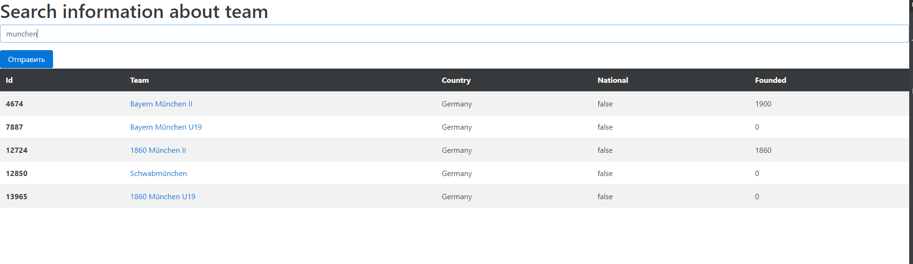

## Api-football client
***
This is an application that allows you to search for football teams info 
using the https://www.api-football.com/ API
### Screenshot


## Technologies
***
A list of technologies used within the project:
* [jdk](https://example.com): Version 15
* [Spring Boot](https://example.com): Version 2.6.3
* [Gradle](https://example.com)
* [Docker](https://example.com)
## Installation
Simply clone this repo:
```bash
git clone https://github.com/pizzazombie/api-football.git
```
or use this link for cloning in your IDE.

## Usage
Request to dashboard needs and api-football token, so application uses mine, token configured   
in application.properties file, you can use your own.  
But be attentive, the number of requests to api-football is limited by your account plan
### Running 
You can build and run application directly in your IDE or by gradle and jdk through that steps:

```bash
# build project
./gradlew build

# run the jar file
java -jar .\build\libs\api-football-0.0.1-SNAPSHOT.jar
```
This application uses port 8090, so you can find it on http://localhost:8090/

### Running in docker

You can use [docker](https://www.docker.com/) for running application in container, for that:
```bash
# build image
docker build -t api-football .

# run in container
run -p 8090:8090 api-football
```
Go to http://localhost:8090/